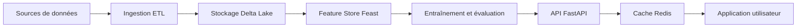
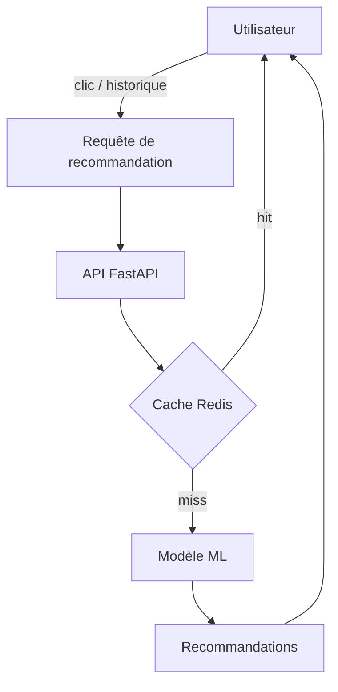

# Architecture fonctionnelle

Ce document présente l’architecture fonctionnelle du projet. Pour les détails techniques et la description des composants, consultez `docs/architecture_technique.md`.

## Vue d’ensemble

## Cas d’usage

## Description des flux

- **Ingestion** : collecte et nettoyage des données Amazon Reviews
- **Stockage** : persistance des tables dans Delta Lake
- **Feature Store** : publication des features utilisateur/produit avec Feast
- **Modélisation** : entraînement hybride ALS + embeddings
- **Serving** : API FastAPI avec cache Redis
- **Interface** : dashboard Streamlit et interface utilisateur
