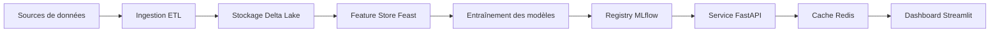

# Architecture technique - Moteur de recommandation e-commerce

## Vue d’ensemble

Ce document présente l’architecture technique du projet, de l’ingestion des données jusqu’au service de recommandation en production.

## Architecture end-to-end

## Composants techniques

### 1. Couche données

- **Sources** : Amazon Reviews (Electronics et Clothing)
- **Format** : JSON / JSON Lines
- **Stockage** : Données stockées sous formas Parquet
- **Validation** : règles de qualité et contrôle des duplications

### 2. Traitement

- **Framework** : PySpark 3.4
- **ETL** : ingestion, nettoyage, enrichissement, agrégation
- **Feature Store** : Feast 0.38
- **Cache** : Redis pour les résultats de recommandations

### 3. Modélisation

- **Collaborative Filtering** : sikit-learn ALS
- **Embeddings** : TensorFlow 2.14
- **Approche hybride** : ALS + contenu pour gérer le cold start
- **Évaluation** : RMSE, Precision@K, NDCG

### 4. Serving

- **API** : FastAPI avec OpenAPI
- **Temps réel** : cache Redis
- **Scalabilité** : services conteneurisés

### 5. Interface

- **Dashboard** : Streamlit
- **A/B testing** : comparaison de variantes

## Flux de données

### Pipeline ETL

1. Ingestion des données brutes
2. Nettoyage et validation
3. Feature engineering
4. Stockage dans Delta Lake

### Pipeline ML

1. Extraction des features
2. Entraînement des modèles
3. Évaluation et comparaison
4. Enregistrement dans MLflow

### Modèle ALS

1. Entraînement sur les intéractions utilisateur-produit
2. Génération de recommandations
3. Mise à jour du cache Redis
4. Réponse aux requêtes API

### Pipeline de serving

1. Requête API
2. Vérification du cache Redis
3. Inférence modèle
4. Réponse utilisateur

## Enjeux techniques

### Cold start

- Utilisateurs avec peu ou pas d’historique
- Stratégie : fallback populaire et recommandations basées sur le contenu

### Scalabilité

- Volume de données important
- Stratégie : Spark distribué et architecture modulaire

### Performance

- Objectif : latence <50ms
- Stratégie : cache Redis et optimisation des services

### Qualité des données

- Valeurs manquantes et doublons
- Stratégie : règles de validation et pipeline automatisé

## Stack technique

### Big Data

- Apache Spark 3.4
- Delta Lake 2.4
- Feast 0.38

### Machine Learning

- sikit-learn 1.3
- TensorFlow 2.14
- MLflow 2.8

### Serving

- FastAPI
- Redis
- Streamlit

### Monitoring

- Prometheus
- Grafana

## Observabilité

### Métriques clés

- CTR
- Conversion rate
- Latence API
- Cache hit rate
- RMSE, Precision@K

### Surveillance infrastructure

- Durée des jobs Spark
- Consommation mémoire
- Charge CPU
- Erreurs API

## Sécurité

### Confidentialité des données

- Anonymisation des identifiants utilisateur
- TLS pour les APIs
- Contrôle d’accès

### Gouvernance des modèles

- Versioning MLflow
- Historique des entraînements
- Traçabilité des features

## Déploiement

### Containerisation

- Docker
- Docker Compose
- Kubernetes (pour la production)

### CI/CD

- Tests unitaires et d’intégration
- Couverture de code >80%
- Déploiement automatisé

### Disponibilité

- Instances multiples
- Reprise automatique
- Sauvegarde régulière

- **Storage**: 100GB SSD

### Serving Infrastructure

- **API Servers**: 2 cores, 4GB RAM × 2
- **Redis**: 4 cores, 8GB RAM
- **Load Balancer**: 2 cores, 2GB RAM

### Testing

Model evaluation:

- **Cross-validation**
- **Performance benchmarking**
- **Overfitting analysis**
- **Inference time**
- **Data consistencey checks**

API evaluation:

- **API endpoint**
- **Cache functionality**
- **Error handling**
- **Performance testing**
